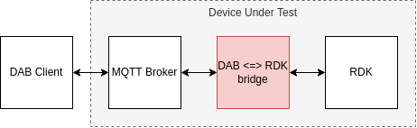
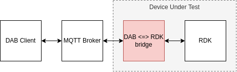
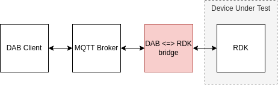

# DAB <==> RDK Adapter #

This software is a RUST application that enables compatibility with [DAB 2.0 specification](https://getdab.org/) to devices based on [Reference Design Kit (RDK)](https://rdkcentral.com/).
The DAB <-> RDK adapter can be executed both on the RDK device or using an external PC.

## Building ##

## For Development/Testing - Option 1: Build on a PC and execute on a RDK device ##

Use [the cross tool](https://github.com/cross-rs/cross) to build `dab-adapter` for the target architecture.

In a PC, install cross:

```
$ cargo install cross
```

Build the application targeting the `armv7-unknown-linux-gnueabihf` architecture:

```
$ cross build --target armv7-unknown-linux-gnueabihf --release
```

The binary application will be the `target/armv7-unknown-linux-gnueabihf/release/dab-adapter` file.

Copy the application to the RDK device.

```
$ scp -O -v -oHostKeyAlgorithms=+ssh-rsa target/armv7-unknown-linux-gnueabihf/release/dab-adapter root@<rdk-device-ip>:/usr/bin/
```

Reboot the RDK device. If the RDK image was previously built with `dab-adapter`, the systemd service will auto-start the application after boot.

## For Development/Testing - Option 2: Build on a PC and Running on a PC ##

Since this software uses Cargo package manager, the building process is straightforward:

```
$ cargo build
```

To execute dab-adapter in your PC, be sure you have mosquitto broker installed, and point to the target board IP.

```
$ cargo run -- -d <rdk-device-ip>
```

**Note:** The voice operators will not be available when running dab-adapter on PC. To use the voice operators, run `dab-adapter` on a RDK device.

## For Deployment ##

Install [cargo bitbake](https://github.com/meta-rust/cargo-bitbake) and create a bitbake recipe and integrate it on Yocto build of RDK.

```
$ cargo install --locked cargo-bitbake
$ cargo bitbake
```


## Usage ##

```
dab-adapter --help

USAGE:
    dab-adapter [OPTIONS]

OPTIONS:
    -b, --broker <MQTT_HOST>    The MQTT broker host name or IP (default: localhost)
    -d, --device <DEVICE>       The device host name or IP (default: localhost)
    -h, --help                  Print help information
    -p, --port <MQTT_PORT>      The MQTT broker port (default: 1883)
    -v, --version               Print the version information
```

## Device ID ##

In this implementation for RDK, the Device ID as specified by DAB is given by the `org.rdk.System.getDeviceInfo`` method of [RDK plugin](https://rdkcentral.github.io/rdkservices/#/api/SystemPlugin).

## Implementations ##

This adapter supports the three full protocol implementation types:

### Option 1: "On Device" Implementation ###



```
$ dab-adapter
```

### Option 2: Remote Broker Implementation ###



Let's suppose `192.168.0.100` as the MQTT Broker IP address:

```
$ dab-adapter -b 192.168.0.100
```

### Option 3: "Bridge" Implementation ###



Let's suppose `192.168.0.200` as the RDK Device (Device Under Test) IP address:

```
$ dab-adapter -d 192.168.0.200
```

## DAB Operations Currently Supported ##

This version currently supports the following DAB operations:

### Applications ###

| Request Topic                    | Supported |
|----------------------------------|-----------|
| applications/list                |    Yes    |
| applications/launch              |    Yes    |
| applications/launch-with-content |    Yes    |
| applications/get-state           |    Yes    |
| applications/exit                |    Yes    |
| device/info                      |    Yes    |
| system/restart                   |    Yes    |
| system/settings/list             |     -     |
| system/settings/get              |     -     |
| system/settings/set              |     -     |
| input/key/list                   |    Yes    |
| input/key-press                  |    Yes    |
| input/long-key-press             |    Yes    |
| output/image                     |    Yes    |
| device-telemetry/start           |     -     |
| device-telemetry/stop            |     -     |
| app-telemetry/start              |     -     |
| app-telemetry/stop               |     -     |
| health-check/get                 |    Yes    |
| voice/list                       |     -     |
| voice/send-audio                 |    Yes    |
| voice/send-text                  |    Yes    |
